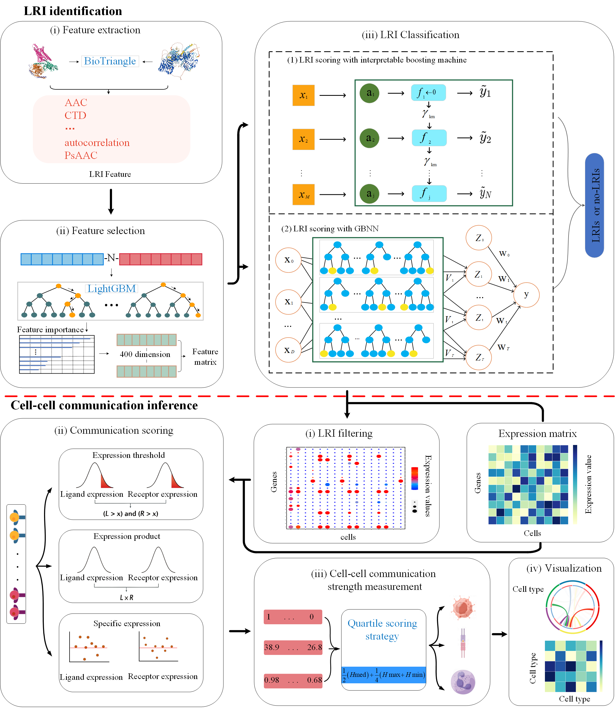

# CellGiQ

## Overview

CellGiQ, a novel framework for deciphering ligand-receptor-mediated cell-cell communication by incorporating machine learning and a quartile scoring strategy from single-cell RNA sequencing data. CellGiQ accurately inferred intercellular communication within human HNSCC tissues. CellGiQ is anticipated to dissect cellular crosstalk and signal pathways at
single cell resolution.

## Environment

1.tensorflow == 2.10.0

2.keras == 2.10.0

3.GBNN == 0.0.2

4.interpret == 0.2.7

5.scikit-learn == 0.24.0

6.lightgbm == 3.3.5

## Data

1.Data is available at [uniprot](https://www.uniprot.org/), [GEO](https://www.ncbi.nlm.nih.gov/geo/).

2.Feature extraction website at  [BioTriangle](http://biotriangle.scbdd.com/)

## Usage

1. We obtain ligand and receptor characteristics

2. Run the model to obtain the LRI, or the user-specified LRI database

   ​		`python code/CellGiQ.py`

3. Using quartile method (including expression threshold method, expression product method and specificity method), the cell communication matrix was finally obtained.

     ​		`python code/case study`

  If you want to test others, just replace the dataset `GSE103322.csv` (Note: use the specified database to replace the dataset` LRI_dataset.csv`)

​		abc

